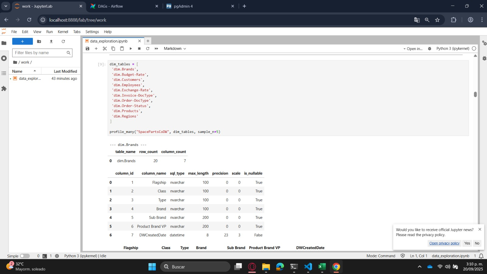

# SpaceParts Data Pipeline - Proyecto ETL

## Descripción General

Este proyecto implementa una solución ETL completa para el dataset SpaceParts utilizando dos enfoques: un **entorno local containerizado** con limitaciones de recursos y una **implementación escalable en Microsoft Fabric**. Se procesa un volumen de **38+ millones de registros** desde 14 tablas fuente hacia 5 tablas optimizadas utilizando arquitectura de medallón.

Datos de insumo: SpaceParts Dataset – Tabular Editor: https://tabulareditor.com/blog/reintroducing-the-spaceparts-dataset

## Estructura del Proyecto

```
spaceparts-data-pipeline/
├── Proceso_Airflow/           # Implementación local con Docker
│   ├── airflow/              # Configuración Airflow
│   ├── dags/                 # Orquestación y procesadores
│   ├── notebooks/            # Análisis exploratorio
│   ├── docker-compose.yaml   # Servicios containerizados
│   └── .env                  # Variables de entorno
├── Proceso_Fabric/           # Implementación Microsoft Fabric
│   ├── Insumos ETL_TEST/     # Notebooks por capa (Bronze/Silver/Gold)
│   ├── Pipelines/            # Orquestadores JSON
│   └── Powerbi/              # Dashboard final
└── README.md
```

## Arquitecturas Implementadas

### 1. Entorno Local - Containerizado (Docker)

**Stack tecnológico:**
- **Jupyter Lab** (`localhost:8888`) - Análisis exploratorio

    En esta etapa se realizó el **testeo de la conexión al servidor** desde el cual se extraerá la información.  
    Es importante destacar que este servicio fue utilizado únicamente para **validar el funcionamiento lógico de los DAGs de Airflow**.  

    En el diagrama se pueden observar las **tablas consultadas**, junto con el detalle de sus columnas y la cantidad de registros obtenidos.  
    En total, se identificaron **14 columnas** y más de **30 millones de registros** procesados durante esta prueba.

    


- **Apache Airflow** (`localhost:8080`) - Orquestación DAGs

    El proceso actual depende de los notebook donde estan las funciones definidas para cada proceso y un archivo .py que realiza el proceso de dags llamando a cada capa con su respectiva función, una muestra de este proceso es el detalle que existe dentro de la capa bronce:

     

     

    **Dag final de ETL**

    

    **Logs del proceso¨**

    

- **PostgreSQL** (`localhost:5432`) - Base de datos principal
        Este componente es el repositorio donde se almacena de forma estructurada toda la información procesada por el pipeline.
        El servicio permanecerá en ejecución y será monitoreado continuamente, permitiendo tanto la persistencia de los datos como la posibilidad de consultarlos en cualquier momento para análisis, validaciones o integración con otros sistemas.

- **pgAdmin** (`localhost:5050`)  
  Herramienta utilizada para el **monitoreo y administración de la base de datos** durante las pruebas.  
  Desde esta interfaz fue posible inspeccionar las tablas cargadas, validar la estructura de las columnas y revisar métricas de volumen de datos en tiempo real.
    

    


**Configuración (.env):**
```env
# Credenciales SpaceParts DB
SPACEPARTS_SERVER=te3-training-eu.database.windows.net
SPACEPARTS_DATABASE=SpacePartsCoDW
SPACEPARTS_USERNAME=dwreader@te3-training-eu
SPACEPARTS_PASSWORD=TE3#reader !

# PostgreSQL Local
POSTGRES_DB=spaceparts_dwh
POSTGRES_USER=airflow
POSTGRES_PASSWORD=airflow
```

**Limitaciones identificadas:**
- Procesamiento por lotes para optimizar recursos
- No disponible cargue directo a Fabric debido a acceso a fabric con credenciales de estudiante. ( Para terminar el proceso en local se requiere secretos cloud)
- Propuesta: FastAPI para exposición vía REST API

### 2. Microsoft Fabric - Cloud

### **Estructura de proyecto**


**Componentes:**
- **Lakehouse**: `spaceparts_fabric_lh`
- **Data Warehouse**: `Thewarehouse` 
- **Pipeline**: Orquestación automatizada diaria
- **Power BI**: Dashboard integrado
- **Notebook**: Insumos de codigo para la ETL

## Dataset SpaceParts - Volúmenes de Datos

### Tablas Fuente (14 tablas)
| Esquema | Tabla | Registros | Descripción |
|---------|-------|-----------|-------------|
| dim | Brands | 20 | Marcas y jerarquías de productos |
| dim | Budget-Rate | 15 | Tasas presupuestarias de conversión |
| dim | Customers | 3,911 | Clientes y cuentas |
| dim | Employees | 893 | Empleados y roles de seguridad |
| dim | Exchange-Rate | 57,900 | Tipos de cambio históricos |
| dim | Invoice-DocType | 5 | Tipos de documento facturación |
| dim | Order-DocType | 4 | Tipos de documento órdenes |
| dim | Order-Status | 6 | Estados de órdenes |
| dim | Products | 256,293 | Catálogo completo de productos |
| dim | Regions | 181 | Regiones y territorios de venta |
| fact | Budget | 2,947,811 | Presupuesto anual por cliente/producto |
| fact | Forecast | 5,197 | Pronósticos mensuales revisados |
| fact | Invoices | 18,459,441 | Facturas y líneas de venta |
| fact | Orders | 16,910,069 | Órdenes de venta y seguimiento |

**Total registros fuente: 38,641,746**

## Arquitectura de Medallón

Actualmente se cuenta con dos notebook por capa, el principal que es un proceso de full date y el segundo que no es utilizado de momento que es el proceso incremental data

ejemplo:


### Capa Bronce (Raw Data)
**Propósito:** Ingesta sin transformaciones desde Azure SQL

**Transformaciones aplicadas:**
- Normalización nombres de columnas (snake_case)
- Preservación tipos de datos originales
- Creación de metadatos de carga (`bronze_created_date`)

**Resultado:** 14 tablas `bronze_*` con 38.6M registros

### Capa Plata (Clean Data)
**Propósito:** Limpieza y estandarización

**Transformaciones aplicadas:**
```python
# Estandarización tipos de datos
- Fechas: bigint → timestamp (nanosegundos/segundos)
- Strings: trim + null standardization
- Keys: uppercase + null handling
- Numerics: NaN → null

# Calidad de datos
- Eliminación duplicados por tabla tipo
- Quarantine registros problemáticos
- Optimización particiones por volumen
```

**Casos específicos detectados:**
- Fechas futuras > 2027 → quarantine
- Valores extremos en montos → quarantine  
- Fechas envío < fechas orden → identificado pero preservado

**Decisión de preservación de datos incompletos:**
> **Nota importante:** Se conservaron registros con datos faltantes o inconsistentes en lugar de eliminarlos, ya que estas anomalías pueden evidenciar **falencias en los procesos originales de captura de datos** en el servidor fuente. La eliminación de estos registros podría ocultar problemas sistemáticos que requieren atención en el origen de los datos.

**Resultado:** 15 tablas `silver_*` con 32.4M registros (6.2M en quarantine para análisis)

### Capa Oro (Business Logic)
**Propósito:** Modelos consolidados para reporting

**Transformaciones de negocio:**
```python
# Consolidación dimensional
- gold_dim_customer: customers + regions + employees (account managers)
- gold_dim_product: products + brands (jerarquías completas)

# Métricas calculadas
- Conversión monedas → EUR (budget rates)
- Sales = net_invoice_value + freight + penalties - taxes
- Document categorization (Invoice/Adjustment/Other)
```

**Tablas finales (5):**
| Tabla | Registros | Descripción |
|-------|-----------|-------------|
| gold_dim_customer | 3,911 | Dimensión clientes consolidada |
| gold_dim_product | 256,293 | Dimensión productos con marcas |
| gold_fact_sales | 17,037,850 | Ventas facturadas en EUR |
| gold_fact_orders | 14,766,489 | Órdenes con seguimiento |
| gold_fact_budget | 276,151 | Presupuesto por mes/cliente/producto |

**Total registros Gold: 32.3M**

Nota: Todas las tablas se almacenan en el Lakehouse, unicamente las ultimas de la capa Gold son copiadas en el Warehouse para el consumo del esquema necesario para el reporte BI.

## Tablas lakehouse:


## Tablas Warehouse:


# Orquestación Microsoft Fabric - Flujo Detallado

## Pipeline Fabric

Se definieron 3 pipeline de los cuales 2 son fijos y 1 es de testeo "Lakehouse_to_Warehouse" se crea unicamente para copiar las tablas gold quemadas en el proceso para pasarlas a Warehouse mientras que "Dataflow Calendar" es un insumo requerido para "Lakehouse_to_Warehouse" donde se espera a crear las tablas gold en el Warehouse y de alli crear la tabla calendario.


### Pipeline ETL_FABRIC - Arquitectura de Ejecución


### Flujo de Actividades Detallado

#### 1. **Capa_Bronce** (Notebook: bronze_full_load.ipynb)
```json
{
    "name": "Capa_Bronce",
    "type": "TridentNotebook",
    "timeout": "0.12:00:00",
    "dependsOn": [],
    "description": "Extracción raw desde Azure SQL"
}
```
- **Entrada:** Azure SQL Database (SpacePartsCoDW)
- **Proceso:** Extracción completa 14 tablas
- **Salida:** Lakehouse tables `bronze_*`
- **Tiempo estimado:** 15-20 minutos

#### 2. **Capa_Silver** (Notebook: Silver_full_load.ipynb)
```json
{
    "dependsOn": [
        {
            "activity": "Capa_Bronce",
            "dependencyConditions": ["Succeeded"]
        }
    ]
}
```
- **Entrada:** Bronze tables
- **Proceso:** Limpieza, deduplicación, quarantine
- **Salida:** Silver tables limpias
- **Tiempo estimado:** 10-15 minutos

#### 3. **Capa_Gold** (Notebook: Gold_full_load.ipynb)
```json
{
    "dependsOn": [
        {
            "activity": "Capa_Silver", 
            "dependencyConditions": ["Succeeded"]
        }
    ]
}
```
- **Entrada:** Silver tables
- **Proceso:** Business logic, joins, consolidación
- **Salida:** 5 tablas gold optimizadas
- **Tiempo estimado:** 8-12 minutos

#### 4. **Copy Activities Paralelas** (Lakehouse → Warehouse)
```json
// Actividades paralelas post Gold exitoso
{
    "name": "Copy_gold_dim_customer",
    "type": "Copy",
    "dependsOn": [{"activity": "Capa_Gold", "dependencyConditions": ["Succeeded"]}],
    "source": {"type": "LakehouseTableSource"},
    "sink": {"type": "DataWarehouseSink", "preCopyScript": "DROP TABLE IF EXISTS"},
    "enableStaging": true
}
```

**Actividades paralelas:**
- Copy_gold_dim_customer
- Copy_gold_dim_product  
- Copy_gold_fact_sales
- Copy_gold_fact_orders
- Copy_gold_fact_budget

**Configuración de Copy:**
- **PreCopyScript:** `DROP TABLE IF EXISTS` para reemplazo completo
- **Staging:** Habilitado para optimización
- **TableOption:** `autoCreate` para esquema dinámico

#### 5. **Dataflow_calendar** (Generación Calendario)
```json
{
    "name": "Dataflow_calendar",
    "type": "RefreshDataflow", 
    "dependsOn": [
        {"activity": "Copy_gold_fact_sales", "dependencyConditions": ["Succeeded"]},
        {"activity": "Copy_gold_fact_orders", "dependencyConditions": ["Succeeded"]},
        {"activity": "Copy_gold_fact_budget", "dependencyConditions": ["Succeeded"]}
    ]
}
```
- **Entrada:** Fechas consolidadas de fact tables
- **Proceso:** Código M para generación calendario
- **Salida:** Tabla calendario en Warehouse

### Sistema de Monitoreo y Alertas

#### Lookup de Errores Automático
```json
// Ejemplo: Lookup_Error_Bronce
{
    "type": "Lookup",
    "dependsOn": [{"activity": "Capa_Bronce", "dependencyConditions": ["Failed"]}],
    "source": {
        "query": "SELECT TOP 1 execution_id, details, error_message, timestamp FROM bronze_execution_log WHERE status = 'Failed' ORDER BY timestamp DESC"
    }
}
```

#### Notificaciones Email Dinámicas
```json
{
    "name": "Email_Notificacion_Error_Bronce",
    "type": "Office365Outlook",
    "Body": "@concat('<h2>Error en Pipeline ETL_FABRIC</h2>',
             '<p><strong>Capa:</strong> Bronce</p>',
             '<p><strong>Execution ID:</strong> ', string(activity('Lookup_Error_Bronce').output.firstRow.execution_id), '</p>',
             '<p><strong>Error:</strong> ', string(activity('Lookup_Error_Bronce').output.firstRow.details), '</p>')"
}
```

### Programación y Triggers
- **Frecuencia:** Diaria automática
- **Hora inicio:** 06:00 AM UTC
- **Duración total:** ~40 minutos
- **Power BI refresh:** +2 horas post-completación
- **Retry policy:** 0 (fail-fast para debugging)

## Tabla Calendario - Generación Automática

**Fuentes consolidadas:**
```sql
-- Fechas extraídas y unificadas
order_date FROM gold_fact_orders      -- Fechas órdenes
budget_month FROM gold_fact_budget    -- Meses presupuesto  
ship_date FROM gold_fact_sales        -- Fechas envío
```

**Código M (Dataflow):**
```m
let
    -- Obtener rango de fechas
    FechaMin = Date.From(List.Min(Origen[DATE])),
    FechaMax = Date.From(List.Max(Origen[DATE])),
    
    -- Generar secuencia completa
    ListaFechas = List.Dates(FechaMin, Duration.Days(FechaMax - FechaMin) + 1, #duration(1,0,0,0)),
    
    -- Transformar a tabla con dimensiones
    ConKey = Table.AddColumn(Tipos, "principalkey", each Number.FromText(Date.ToText([date], "yyyyMMdd")), Int64.Type),
    ConYear = Table.AddColumn(ConKey, "year", each Date.Year([date]), Int64.Type),
    ConQuarter = Table.AddColumn(ConYear, "Quarter", each Date.QuarterOfYear([date]), Int64.Type),
    ConMonthName = Table.AddColumn(ConQuarter, "MonthName", each Date.ToText([date], "MMMM", "es-ES"), type text)
in
    Calendario
```
## Arquitectura de los pipeline:

### ETL_FABRIC
---

---
### Dataflow Calendar
---

---
### Dataflow Calendar
---

---
Nota: En caso de fallar alguna de las etapas de "ETL_FABRIC" se notifica inmediatamente por correo electronico al responsable de la ETL.

## Dashboard Power BI

### Estructura (5 páginas)
- **Inicio:** Landing HTML con navegación

    

- **Resumen:** KPIs consolidados 

    

    

- **Orders:** Análisis órdenes y OTD


- **Budget:** Seguimiento presupuestario


- **Sales:** Rentabilidad y márgenes


## Modelo semantico


### Medidas DAX Implementadas
```dax
Sales Only = 
    CALCULATE(
        SUM(gold_fact_sales[sales_eur]),
        gold_fact_sales[document_category] = "Sale"
    )

Total COGS = SUM(gold_fact_sales[cogs_eur])

Gross Margin = [Sales Only] - [Total COGS]

Budget Variance = [Sales Only] - SUM(gold_fact_budget[budget_eur])

Achievement % = 
    DIVIDE([Sales Only], SUM(gold_fact_budget[budget_eur]), 0) * 100
```

### Funcionalidades UX
- Navegación por marcadores y botones
- Menús desplegables interactivos
- Relaciones: Calendar ← → Customer ← → Product
- HTML personalizado en página inicio

## Hallazgos y Casos Atípicos

### Problemas de Calidad Identificados
- **1.048M registros** con fechas envío < fechas orden
- Definiciones inconsistentes de "On-Time Delivery"
- Monedas locales sin conversión en tablas origen
- Documentos tipo "Warranty" con valores negativos

### Decisiones de Preservación de Datos
Los registros con inconsistencias se mantuvieron intencionalmente para:
- Evidenciar problemas en procesos de captura upstream
- Permitir análisis de calidad de datos por parte del negocio
- Evitar pérdida de información que podría ser corregible en origen

### Arquitecturas Evaluadas
- **Lambda Architecture:** Descartada (no requiere tiempo real)
- **FastAPI wrapper:** Propuesta para exposición PostgreSQL
- **Incremental loads:** Implementado por rendimiento

## Ejecución y Despliegue

### Local (Docker)
```bash
cd Proceso_Airflow/
docker-compose up -d

# Verificar servicios
curl localhost:8080  # Airflow
curl localhost:5050  # pgAdmin
```

### Fabric
1. Importar notebooks: `/Insumos ETL_TEST/`
2. Crear Lakehouse + Warehouse
3. Importar pipeline: `/Pipelines/ETL_FABRIC/ETL_FABRIC.json`
4. Configurar ejecución diaria

## Métricas de Rendimiento

| Métrica | Local | Fabric |
|---------|--------|--------|
| Tiempo total ETL | ~2h | ~40min |
| Throughput | 5.4M rec/h | 48.6M rec/h |
| Storage Bronze | 2.1GB | Lakehouse |
| Storage Silver | 1.8GB | Lakehouse |  
| Storage Gold | 950MB | Warehouse |

**Limitación actual:** Entorno local requiere procesamiento por lotes debido a restricciones de memoria (8GB RAM).

---

**Repositorio:** WSL2 + GitHub  
**Dataset:** SpaceParts (Tabular Editor)  
**Volumen total:** 38.6M → 32.3M registros  
**Registros preservados:** 6.2M en quarantine para análisis de calidad
